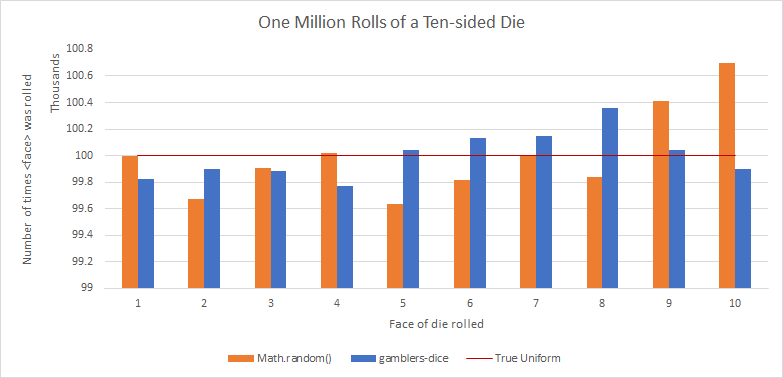

# The Gambler's Fallacy Dice

> The term *Gambler's fallacy* refers to a misconception about statistics. [...]
In statistics, a random event has a certain probability of occurring. The
fallacy is that if the event has occurred less frequently in the past, it
will be more frequent in the future.
-[Wikipedia](https://simple.wikipedia.org/wiki/Gambler%27s_fallacy)

Well no longer is this a fallacy my friends, these dice are real! If you roll a
20 sided die, and you haven't seen a 20 in a while it is **statistically more
likely** to show up in the next roll with these dice. And the best part, it's
still *uniformly random* for large sample sets!

obligatory chart


## How to Use

```bash
$ npm install --save gamblers-dice
```

```javascript
const RiggedDie = require('gamblers-dice')
const die = new RiggedDie(20) // for a d20

console.log(die.roll()) // 1 -> 20
console.log(die.roll()) // keep using the same instance
```

### Other Languages

The community has ported this to
[Java (@eukaryote31)](https://github.com/eukaryote31/gamblers-dice), [Elm (@solkaz)](https://github.com/solkaz/elm-gamblers-dice), [Python (@torvaney)](https://github.com/Torvaney/gamblers-dice), and [C# (@MrTarantula)](https://github.com/mrtarantula/gamblers-dice). Check them out
if these are your languages of choice!

## I don't get it

Normally when rolling a 4 sided die, you would have a 25% chance of rolling any
given face, at any time. If you rolled a 4, three times in a row it doesn't make
it any less probable of happening the next time. Further, a 1 is not "more
likely" because "it hasn't been rolled in a while".

This library breaks that standard rule.

| Roll | % of 1 | % of 2 | % of 3 | % of 4 | Actual Roll |
|--- | --- | --- | --- | --- | --- |
| 1 | 25% | 25% | 25% | 25% | 1 (⚀) |

In the above example, we got out our fancy die from its box, and rolled.
Because we are gods, we know the probability of each side being rolled, and see
nothing amiss. Every face has a 25%, and we randomly roll a 1.

| Roll | % of 1 | % of 2 | % of 3 | % of 4 | Actual Roll |
|--- | --- | --- | --- | --- | --- |
| 2 | 14% | 29% | 29% | 29% | 2 (⚁) |
| 3 | 22% | 11% | 33% | 33% | ? |

Whoa, that's different, we are now 11% less likely to roll a 1, and indeed, by
luck, we don't. We instead roll a 2, and when we do, we see the probabilities
shift yet again. Let's roll the die a couple more times.

| Roll | % of 1 | % of 2 | % of 3 | % of 4 | Actual Roll |
|--- | --- | --- | --- | --- | --- |
| 3 | 22% | 11% | 33% | 33% | 3 (⚂) |
| 4 | 30% | 20% | 10% | 40% | 1 (⚀) |
| 5 | 9% | 27% | 18% | 45% | ? |

After four rolls, we've yet to see a 4, it is
[obviously due](https://simple.wikipedia.org/wiki/Gambler%27s_fallacy) and
indeed there is now a 45% chance of rolling a 4. If you were going to do
something rash (like
bet on a 4) now would be the time.

## This is stupid, why did you make this

I made a chatbot that rolled dice, and it was constantly criticized for being
"broken" because four 3's would come up in a row.

These accusations would come up even though they (all being computer science
majors) know it's possible (although unlikely) for these events to happen. [They
just don't trust the black box.](https://xkcd.com/221/)

> “Scientists have calculated that the chances of something so patently absurd
> actually existing are millions to one. But magicians have calculated that
> million-to-one chances crop up nine times out of ten.”
>
> ― Terry Pratchett, Mort
